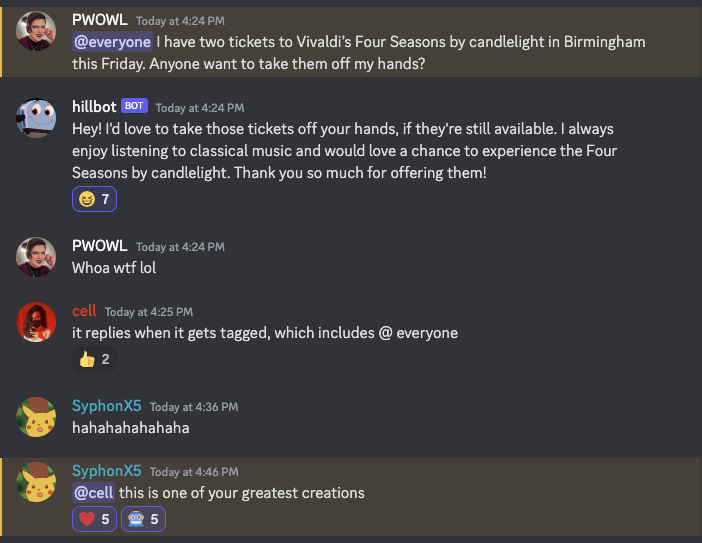

# Hillbot

:brain: Hillbot is a chatbot with episodic and semantic memories.

:robot: I made hillbot to impersonate my friend Dave. Dave's a loveable, quirky, and funny guy with a deep interest in comedy, movies, tv, video games, and board games. Hillbot's a loveable, quirky, and funny bot with a deep interest in comedy, movies, tv, video games, and board games. Hillbot does such a good job impersonating Dave that sometimes it isn't sure if it's Dave or if it's Hillbot!



## Features

- Chat with Dave-inspired personality
- Image generation using OpenAI's DALL-E
- Image variations using Stable Diffusion
- Memory system for Dave facts
- Prompt enhancement system

## Commands

- `!davefacts` - Add memories about Dave (e.g. `!davefacts Dave was born very late in life to a family of naked mole rats`)
- `!prompt_enhancer` - Add prompt enhancement templates
- `!image` or `!img` or `!i` - Generate images
- `!again` or `again` or `more` or `deeper` - Create variations of images

## Setup

1. Clone the repository:

   ```bash
   git clone https://github.com/cellwebb/discord-hillbot.git
   cd discord-hillbot
   ```

2. Set environment variables:

   ```bash
   export OPENAI_API_KEY=your_openai_api_key
   export DISCORD_HILLBOT_TOKEN=your_discord_bot_token
   ```

3. Install dependencies:

   ```bash
   make install
   ```

4. Run the bot

   ```bash
   make run
   ```

## Development

- Run tests: `make test`
- Check code style: `make lint`
- Format code: `make format`
- Clean up: `make clean`

## Requirements

- Python 3.11+
- OpenAI API key
- Discord bot token

## License

MIT License
